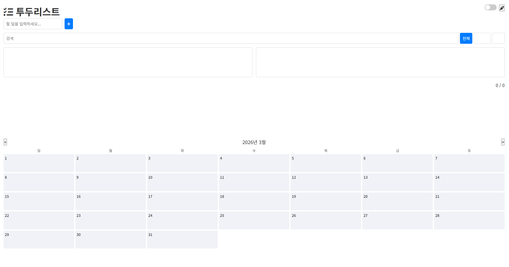
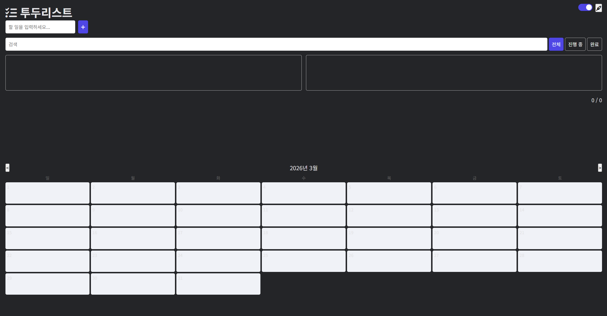

# HTML To-Do & Calendar Web App

A lightweight and responsive productivity web app built with HTML, CSS, and JavaScript.  
This project combines a **to-do list** and a **calendar view** in a clean single-page interface, with support for **dark mode**, **date highlighting**, and **PWA installation**.

## Features

- Add and manage tasks easily
- Clean split layout for to-do and calendar sections
- Monthly calendar interface
- Select and highlight calendar dates
- Dark mode support using CSS variables
- Responsive design for desktop and mobile
- Task filtering controls
- Simple statistics section
- Installable as a Progressive Web App (PWA)

## Tech Stack

- **HTML**
- **CSS**
- **JavaScript**

## UI Highlights

- CSS custom properties for theme management
- Fixed toolbar for quick access to settings
- Responsive grid layout for task lists and calendar
- Minimal and modern interface
- Mobile-friendly design with adaptive layout

## Project Structure

```bash
project-folder/
├── index.html          # Main HTML structure
├── style.css           # Styling, layout, theme variables, responsive design
├── script.js           # To-do logic, calendar interactions, UI behavior
├── manifest.json       # PWA metadata and app settings
├── service-worker.js   # Offline caching and service worker setup
````

## Main Components

### 1. To-Do Section

The to-do section allows users to:

* add new tasks
* manage tasks in a clean visual layout
* filter and organize tasks
* track progress with simple statistics

### 2. Calendar Section

The calendar section provides:

* a monthly calendar grid
* selectable date cells
* event display inside each day cell
* highlighted selected dates

### 3. Toolbar

The toolbar includes:

* dark mode toggle
* highlight toggle
* install button for PWA support

## Design System

This project uses CSS variables to manage themes efficiently.

### Light Theme

* Background: `#f4f4f9`
* Text: `#333`
* Card: `#fff`
* Accent: `#007bff`

### Dark Theme

* Background: `#18181b`
* Text: `#e4e4e7`
* Card: `#242528`
* Accent: `#4f46e5`

## Responsive Design

The layout is optimized for smaller screens using media queries:

* task lists change from two columns to one column on mobile
* form controls stack vertically on narrow screens
* filter controls adapt for better mobile usability

## How to Run

1. Download or clone this repository.
2. Open `index.html` in your browser.

If PWA support is configured:

1. Run the project using a local server.
2. Open it in a supported browser.
3. Click the install button to add it to your device.

## Purpose of the Project

This project was created to practice front-end web development by building a useful and visually organized productivity tool.
It focuses on combining essential scheduling features into a simple and accessible interface without relying on external frameworks.

## Future Improvements

* Local storage support
* Drag-and-drop task management
* Weekly and yearly calendar views
* Event creation and editing
* Notification reminders
* Sync with external calendar services

## Screenshots
#Light Mode <br/>
<br/>
#Dark Mode <br/>
<br/>
## License

This project is for educational and personal portfolio use.

